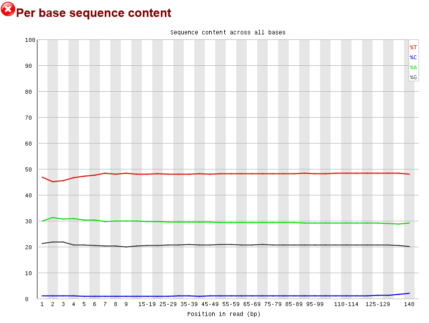
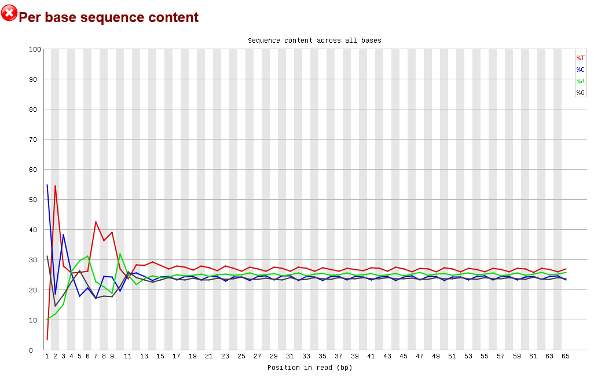
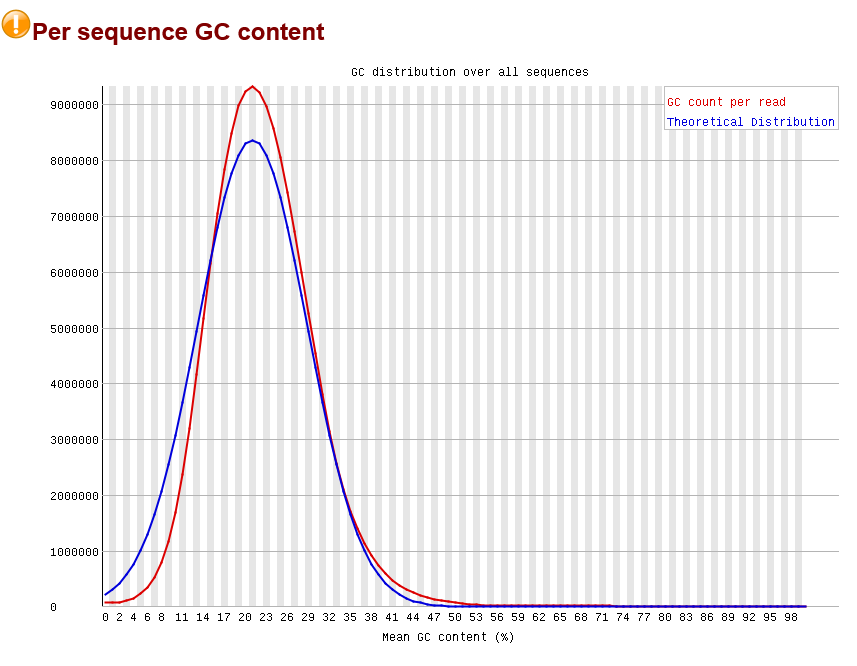
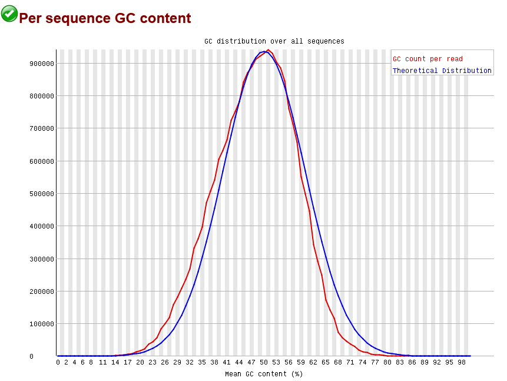
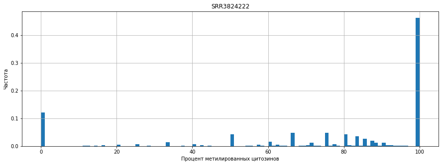
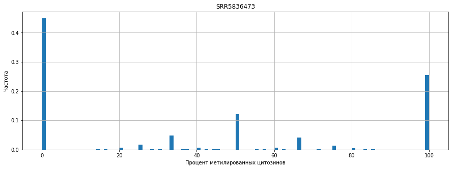
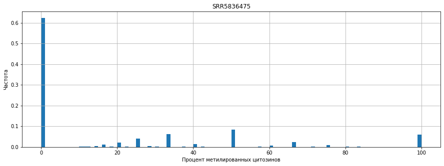
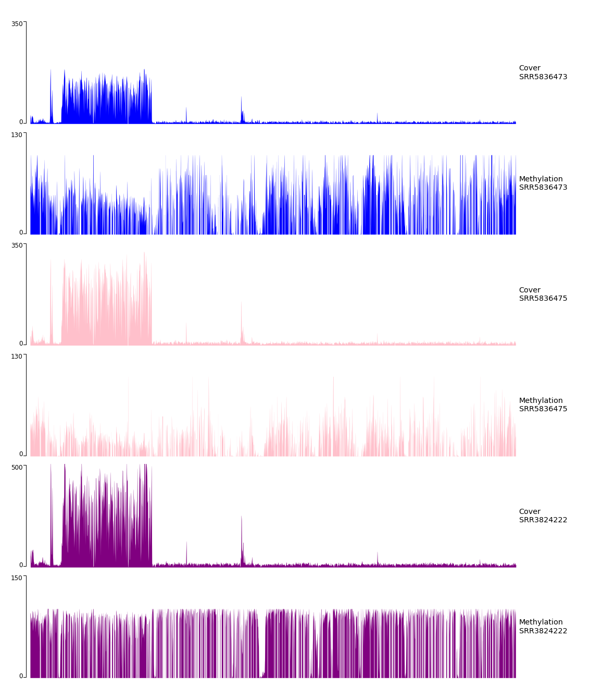
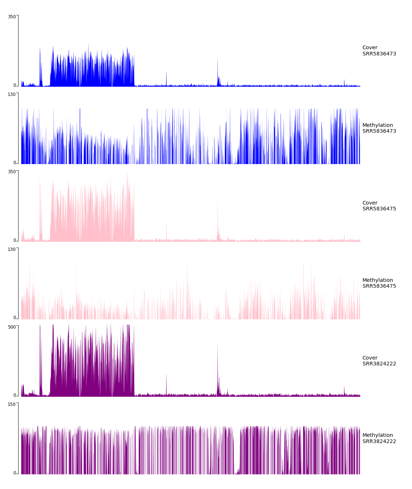

# hse_hw1_meth
# Colab
```
https://colab.research.google.com/drive/1zM28Fag5K8VMNKs5O2Ojy2CG8dN3D1_8?usp=sharing
```
# Сравнение с РНК
## Статистика
BS-Seq | РНК 
--- | --- 
 | 

Заметим, что в РНК процент GC более чем в два раза выше, чем у BS-Seq.

## Per base sequence content
Read 1 | Read 2 
--- | --- 
 |  

Заметим, что в первом случае почти отсутствуют Цитозины (C), cодержание Гуанина (G), ниже чем в РНК, а Тимина (T) – выше.

## Per sequence GC content

Read 1 | Read 2 
--- | --- 
 |  

Заметим явное смещение нормального распределения для GC count per read.
# Число ридов
BS-Seq | 11347700-11367700 | 40185800-40195800 | deduplication % 
--- | --- | --- | ---
SRR5836473 | 1090 | 464 | 81.69
SRR3824222 | 2328 | 1062 | 97.08
SRR5836475 | 1456 | 630 | 90.92
# BASH-скрипт
```
!ls *pe.bam | xargs -P 4 -tI{} deduplicate_bismark  --bam  --paired  -o s_{} {}
```
# M-Bias Plots
## Вывод
 - Заметим, что уровень CpG метилирования у epiblast самый высокий (около 80%), у 8cell он уже меньше половины (около 40%), и у ICM составляет около 20%. Заметим, что значение процента CpG метилирования уменьшается в два раза. 
 - Однако, если мы расставим их в хронологическом порядке 8cell-ICM-epiblast, то динамика будет следующая: 40%-20%-80%. То есть рост уровня метилирования не линейный, и увеличивается в два раза относительно начальной стадии зародыша (2.25 дней) к (6.5 дням).
 - Уровень метилирования CHH и CHG почти равны нулю в первом чтении,во втором чтении на начальных позициях он равен почти 40%, но затем стремительно падает в ноль. 
## Отчёт
Мы видим график смещения метилирования, который показывает пропорцию метилирования для каждой возможной позиции в прочтении. На графиках также показано абсолютное значение  метиловых calls (и метилированных, и не метилированных). В нашем случае, мы имеем дело с paired-end записью, поэтому у нас два разных графика M-bias. На данных графиках мы можем выявить смещение 3'-end-repair начальных значений в двух прочтениях paired-end reads. 
## SRR3824222
Read 1 | Read 2 
--- | --- 
 |  
## SRR5836473
Read 1 | Read 2 
--- | --- 
 | 
## SRR5836475
Read 1 | Read 2 
--- | --- 
 | 

# Гистограмы распределения метелирования цитозинов по хромосоме
## CODE
```python
import pandas as pd
from matplotlib import pyplot as plt
path = '/content/SRR3824222/s_SRR3824222_1_bismark_bt2_pe.deduplicated.bedGraph'
bedGraph = pd.read_csv(path,  delimiter='\t', skiprows=1, header=None)
fig = plt.figure(figsize=(15, 5))
plt.title('SRR3824222') 
plt.hist(bedGraph[3], bins=100, density=True)
plt.grid()
plt.xlabel('Процент метилированных цитозинов')
plt.ylabel('Частота')
plt.show()
```
## Вывод
 - Можем заметить, что самая высокая частота 100% метилирования (почти 0.5) у epiblast. Наоборот у 8cell, здесь мы видим примерно такую же частоту (почти 0.5), но уже 0% метилирования цитозина. Однако, именно у ICM максимальная частота (выше 0.6) нулевого метилирования цитозина.
8cell-ICM-epiblast
 - Заметим, что на стадии 6.5 дней у нас максимальный уровень метилирования, на стадии в 3.5 дней (ICM) у нас максимальная частота нулевого метилирования, а на начальной стадии у нас равномерное распределение процентов метилирования на диапазоне от 0% до 100% (НЕ включая границы), однако, явно преоблает 0% метилирование цитозина.
 - Данные результаты не противоречат графикам M-Bias. У нас действительно нет прямой зависимости между уровнем метилирования цитозина и стадией зародыша (во всяком случае, на данных трёх экземплярах нельзя однозначно утверждать про взаимосвязь).
## SRR3824222 (epiblast)

## SRR5836473 (8cell)

## SRR5836475 (ICM)


# Визуализация уровня метелирования и покрытия

## chr11:3100030-3500030



## chr11:3100030-3400030

 
