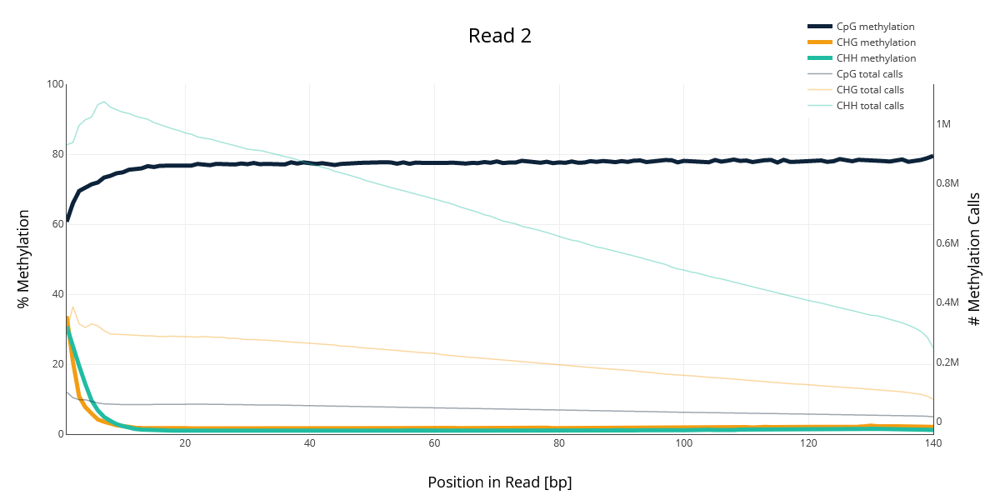

# hse_hw1_meth
# Colab
```
https://colab.research.google.com/drive/1zM28Fag5K8VMNKs5O2Ojy2CG8dN3D1_8?usp=sharing
```
# Сравнение с РНК
## Статистика
BS-Seq | РНК 
--- | --- 
 |  
Заметим, что в РНК процент GC более чем в два раза выше, чем у BS-Seq.
# Число ридов
BS-Seq | 11347700-11367700 | 40185800-40195800 | deduplication % 
--- | --- | --- | ---
SRR5836473 | 1090 | 464 | 81.69
SRR3824222 | 2328 | 1062 | 97.08
SRR5836475 | 1456 | 630 | 90.92
# BASH-скрипт
```
!ls *pe.bam | xargs -P 4 -tI{} deduplicate_bismark  --bam  --paired  -o s_{} {}
```
# M-Bias Plots
## Отчёт
Мы видим график смещения метилирования, который показывает пропорцию метилирования для каждой возможной позиции в прочтении. На графиках также показано абсолютное значение  метиловых calls (и метилированных, и не метилированных). В нашем случае, мы имеем дело с paired-end записью, поэтому у нас два разных графика M-bias. На данных графиках мы можем выявить смещение 3'-end-repair начальных значений в двух прочтениях paired-end reads. 
## SRR3824222
Read 1 | Read 2 
--- | --- 
 |  
## SRR5836473
Read 1 | Read 2 
--- | --- 
 | 
## SRR5836475
Read 1 | Read 2 
--- | --- 
 | 
